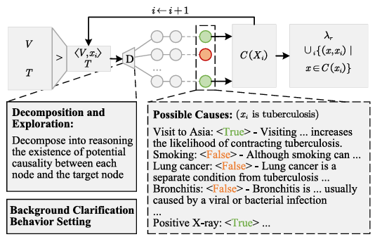

# LLM-Augmented Causal Discovery Toolkit: A Technical Introduction

## **Background and Challenges**

Inferring causal relationships from observational data is a core challenge in data science and related research fields. Traditional causal discovery methods rely heavily on prior knowledge from domain experts for guidance. However, acquiring such knowledge often involves significant costs in terms of both time and money, which largely limits the application scope of advanced causal discovery techniques.

## **Opportunities and Challenges of Large Language Models**

The emergence of Large Language Models (LLMs) has provided new possibilities for acquiring prior knowledge. By querying LLMs about the relationships between variables, researchers can obtain judgments that approach the level of an expert. The advantage of this approach lies in significantly reducing the cost of knowledge acquisition. Furthermore, in some scenarios, the knowledge provided by LLMs can be more objective than the judgments of non-professionals.

However, this new paradigm is also accompanied by challenges. LLMs have inherent instability; queries on the same topic may return inconsistent or even self-contradictory results. Using this inaccurate or internally contradictory information directly as priors can not only fail to improve model performance but may also negatively impact the accuracy of the final analysis.

## **Our Approach and the Toolkit's Core Functionality**

To address this challenge, we have developed this toolkit. It aims to fully leverage the powerful knowledge base of LLMs while systematically mitigating the risks associated with their instability.

Our core approach is inspired by the latest research findings: guiding an LLM to determine the concrete temporal order of events yields more reliable and stable outputs compared to directly asking it to judge abstract causal relationships.

Based on this, the core functionalities of this toolkit include:

  * **Structured Knowledge Elicitation**: After the user defines the research scenario and variables, the toolkit automatically generates structured queries to guide the LLM, efficiently extracting high-confidence information regarding the temporal order of variables.
  * **Integration and Refinement of Model Outputs**: The toolkit includes a built-in analytical mechanism to process the initial information returned by the LLM. It systematically integrates these potentially inconsistent, localized judgments with the goal of refining a more globally consistent and reliable variable ordering.
  * **Compatibility with Downstream Algorithms**: The refined temporal priors produced by the toolkit can serve as high-quality constraints and be flexibly applied to various mainstream causal discovery algorithms, helping to construct more accurate and robust causal structures from real-world data.


## **Framework Overview**


The above framework diagram provides a more intuitive understanding of the entire workflow.

The entire process can be summarized into several high-level stages:

  * **Stage 1: Initial Knowledge Generation (Partial Order Generation)**

      * In this stage, we initiate structured queries to the LLM through scenario simulation and metadata input.
      * The objective is to obtain the model's preliminary, discrete judgments about the temporal sequence of variables.

  * **Stage 2: Knowledge Integration and Refinement (Conflicting Decomposition & Optimal Total Order Discovery)**

      * This is a critical step in the process. The toolkit systematically analyzes all preliminary judgments obtained from the LLM.
      * It integrates these scattered and potentially inconsistent local pieces of information with the aim of refining a more globally consistent and reliable variable ordering.

  * **Stage 3: Guiding Downstream Analysis (Order-based Causality)**

      * Finally, this refined global ordering serves as a high-quality prior knowledge.
      * It can be input into any standard causal discovery algorithm chosen by the user, acting as a strong external guide to help the algorithm converge more accurately on the real data to infer the final causal graph.

In short, the core of this framework is to transform the potentially vague, contradictory, and localized knowledge provided by an LLM into a clear and reliable global variable ordering through a series of systematic steps, thereby providing effective support for data-driven causal learning.


## **Conclusion and Outlook**

We expect this toolkit to provide effective support for professionals engaged in causal science research and practice, helping users leverage the powerful knowledge source of Large Language Models more conveniently and reliably. We believe this approach offers a valuable technical direction for performing causal discovery in a stable and cost-effective manner and look forward to promoting the further development of this field in collaboration with both academia and industry.


# Several LLM-based Methods Can Be Used

This section introduces some methods for discovering and generating priors using large language models, for reference.

## LLM-Driven Causal Discovery via Harmonized Prior

The core idea of this framework is to use an LLM as a knowledge expert. Through specially designed Prompting Strategies, it guides the LLM to perform causal reasoning from two different yet complementary perspectives to generate a reliable "Harmonized Prior". This harmonized prior is then integrated into mainstream causal structure learning algorithms to enhance the accuracy and reliability of discovering causal relationships from data.


The overall logical flow of the framework is shown in the above figure and primarily consists of three parts: Dual-Expert LLM Reasoning, Harmonized Prior Construction, and Plug-and-Play Structure Learning.


**1. Dual-Expert LLM Reasoning Module**
To ensure the accuracy of the causal knowledge provided by the LLM, this framework does not have the LLM directly judge the complex relationships between all pairs of variables. Instead, it configures the LLM into two different expert roles focused on specific tasks: the Conservative Expert and the Exploratory Expert.

* **Conservative Expert - Aims for Precision**
* 


    * As shown in the above figure, the goal of the Conservative Expert is to identify the most explicit and reliable causal relationships.
    * It first uses "single-step reasoning" to quickly screen for causal pairs with the highest confidence.
    * Subsequently, it employs a "Decomposition and Verification" strategy to meticulously verify and reconfirm these selected relationships one by one, in order to filter out potential spurious associations.
    * The final output is a high-precision set of causal relationships, $\lambda_p$, which is used as a "Path Existence" constraint. That is, if $(A,B)$ is in this set, it is believed that a path from A to B exists in the true causal graph.

* **Exploratory Expert - Aims for Recall**
* 


    * As shown in the above figure, the goal of the Exploratory Expert is to identify all potential causal links as comprehensively as possible.
    * This module centers on each variable, analyzing one by one which other variables in the dataset could be its direct causes.
    * Through this "Decomposition and Exploration" approach, it generates a list of "possible causes" $C(x_i)$ for each variable.
    * All these possible causes are aggregated into a high-recall set of causal relationships, $\lambda_r$. This set is used to define an "Edge Absence" constraint, meaning if a causal relationship $(A,B)$ does not appear in this set, generating a direct edge from A to B in the final causal graph is forbidden.

**2. Harmonized Prior Construction**
The framework fuses the causal knowledge output by the two aforementioned experts to construct a unified "Harmonized Prior". This harmonized prior combines the advantages of both:

* **Path Existence Constraint:** Utilizes the high-precision causal relationships $\lambda_p$ output by the Conservative Expert.
* **Edge Absence Constraint:** Utilizes the high-recall causal relationships $\lambda_r$ output by the Exploratory Expert to define the scope of possible direct edges¹⁶.

In this way, it not only ensures that strong causal signals are not lost but also effectively constrains the search space for structure learning by ruling out a large number of impossible causal connections, thereby improving overall accuracy.

**3. Integration with Structure Learning Algorithms**
Finally, this constructed "Harmonized Prior" is integrated in a "plug-and-play" manner into various mainstream causal structure learning algorithms, as shown in the top box of Figure 1. Whether they are Score-based, Constraint-based, or Gradient-based methods, all can leverage this harmonized prior to guide their search process, ultimately learning a more accurate and reliable causal graph from observational data.


# Dictionary


## Dataset Part

#### `data_structure`

- `{Dataset_name}`

    - `{Dataset_name}_graph.txt`：The ground truth causal graph of the dataset variables.

    - `{Dataset_name}.mapping`：Mapping of dataset variable names.

#### `dataset`

- `{data}`

    - `{Dataset_name}`

        - `{Dataset_name}_continues_{n}dsize_random{r}`：Synthetic datasets, n represents the ratio of dataset size to the number of variables, r represents random generation parameters.


## LLM Part


#### `prompt_design`

-   `description`

    -   `{Dataset_name}.json`：Explanation of variables in the dataset.

-   `prompt_generation.py`：Generate the required prompt based on the content in the description.

-   `prompt`

    -   `{Dataset_name}`

        -   `{Dataset_name}_{Variable_name}.txt`：The actual prompt used.

#### `LLM_query`

-   `api.py`：Call the API to inquire about the causal relationships of dataset variables.

-   `LLM_answer`

    -   `{Dataset_name}`

        -   `{LLM_name}`

            -   `{Variable_name}.txt`：The causal relationships (causes and effects) of a specific variable in the dataset.


## Causal Discovery Part


#### `prior_knowledge`

-   `knowledge_matrix_convert.py`：Clean the knowledge provided by the large model and convert it into matrix form.

-   `LLM_knowledge`

    -   `{Dataset_name}`

        -   `{Dataset_name}_{LLM_name}.txt`：Large model knowledge stored in matrix form.

-   `generation_edge_prior.py`：Generate edge priors based on large model knowledge or the ground truth causal graph.

-   `prior_based_on_LLM`

    -   `{Dataset_name}`

        -   `{Dataset_name}_{LLM_name}.txt`：Edge prior matrix generated based on the large language model.

-   `prior_based_on_ground_truth`

    -   `{Dataset_name}`

        -   `{Dataset_name}.txt`：Edge prior matrix generated based on the ground truth causal graph.

#### `src`

-   `{method_name}.py`：Main method for causal discovery.

#### `causal_discovery`

-   `evalution.py`：Evaluation functions used during the training process.

-   `preparation.py`：Preparatory work such as parameter setting.

-   `main.py`：Main program.

#### `out`

-   `output.csv`：Display of various parameters and metrics of the model training results.
 
# Usage

## **Installation Guide for LLM-based-causal-discovery**

This guide provides step-by-step instructions for downloading the `LLM-based-causal-discovery` project and setting up its local environment.

Follow these steps to get the project running.

#### **Step 1: Clone the GitHub Repository**

Open your terminal (Command Prompt or PowerShell on Windows, Terminal on macOS/Linux) and use the `git clone` command to download the project source code.

```bash
git clone https://github.com/WXY604/LLM-based-causal-discovery.git
```

This will create a folder named `LLM-based-causal-discovery` in your current directory. Navigate into this new folder:

```bash
cd LLM-based-causal-discovery
```

#### **Step 2: Create and Activate a Python Virtual Environment**

Using a virtual environment is highly recommended to keep project dependencies isolated.

* **Create the virtual environment** (we'll name it `venv`):

    ```bash
    python -m venv venv
    ```

* **Activate the virtual environment**:
    * **On Windows**:
        ```bash
        .\venv\Scripts\activate
        ```
    * **On macOS and Linux**:
        ```bash
        source venv/bin/activate
        ```

    Once activated, you will see `(venv)` at the beginning of your terminal prompt.

#### **Step 3: Install Project Dependencies**

All required Python libraries are listed in the `Requirement.txt` file. You can install them all with a single `pip` command.

Make sure your virtual environment is activated, then run:

```bash
pip install -r Requirement.txt
```

`pip` will automatically read the file and install all necessary packages. This process may take a few moments.

---

## **Runbook**

This guide provides detailed instructions for running the causal discovery process in different scenarios.

### **Scenario 1: Running Causal Discovery Algorithm Only**

If you already have all the pre-processed data and prior knowledge, you can run the main program directly to perform causal discovery.

* **Execute the command:**
    ```bash
    python tools/causal_discovery/main.py
    ```

### **Scenario 2: Causal Discovery from a Raw Dataset**

This workflow guides you through the entire process, from downloading a raw dataset to completing the causal discovery.

1.  **Prepare Ground Truth and Mapping Files**
    * Download the dataset's ground truth causal graph and variable mapping files from the relevant data source (e.g., project homepage, paper's repository).
    * Place these files into the specified directory structure:
        ```
        data_structure/{Dataset_name}/
        ```
        > `{Dataset_name}` should be replaced with the name of your dataset.

2.  **Prepare the Dataset Data File**
    * Download the data file in `.csv` or `.txt` format.
    * Place it into the specified directory structure:
        ```
        dataset/data/{Dataset_name}/
        ```
    * **Note:** By default, the project code reads filenames in a specific format (e.g., `Dataset_name_continues_...`). If your data filename does not follow this standard, you will need to modify the data loading logic in the `tools/causal_discovery/main.py` file accordingly.

3.  **Generate the Prior Matrix**
    * Run the following script to generate the edge prior matrix required by the algorithm, based on the ground truth.
    * **Execute the command:**
        ```bash
        python tools/causal_discovery/prior_knowledge/generation_edge_prior.py
        ```

4.  **Run the Main Program**
    * Once everything is prepared, run the main program to start the causal discovery process.
    * **Execute the command:**
        ```bash
        python tools/causal_discovery/main.py
        ```

### **Scenario 3: LLM-Assisted Causal Discovery**

This workflow uses external knowledge from a Large Language Model (LLM) as a prior to assist in causal discovery.

1.  **Prepare Ground Truth and Mapping Files**
    * Follow the same instructions as in Step 1 of **Scenario 2**.

2.  **Prepare the Dataset Data File**
    * Follow the same instructions as in Step 2 of **Scenario 2**.

3.  **Obtain the LLM Knowledge Matrix**
    * Use the tools provided in `LLM_query` or your own methods to query an LLM about the causal relationships between variables.
    * Clean and organize the results into a knowledge matrix. Ensure that its **format is consistent with the example file (`LLM_knowledge/{Dataset_name}/{Dataset_name}_{LLM_name}.txt`)**.

4.  **Generate Prior Matrix from LLM Knowledge**
    * First, you need to **modify** the `tools/causal_discovery/prior_knowledge/generation_edge_prior.py` script to switch its logic to generate the edge prior matrix based on **LLM/expert knowledge**.
    * After modifying the script, run it:
        ```bash
        python tools/causal_discovery/prior_knowledge/generation_edge_prior.py
        ```

5.  **Run the Main Program**
    * Using the prior matrix that incorporates LLM knowledge, run the main program to perform causal discovery.
    * **Execute the command:**
        ```bash
        python tools/causal_discovery/main.py
        ```


